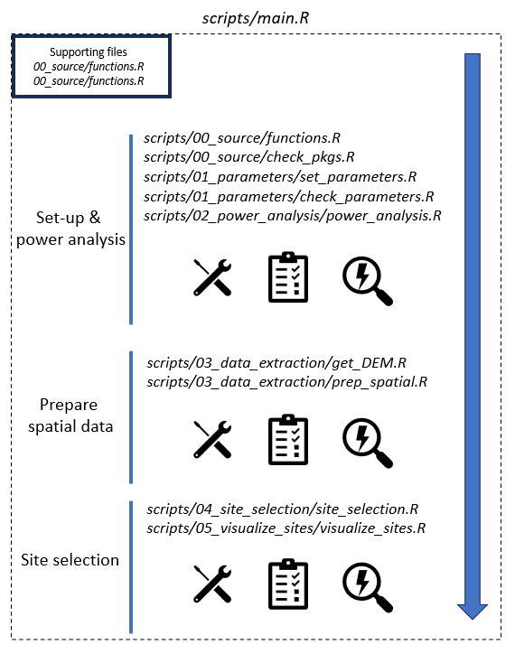

## Microclimate Sensor Networks: Site Selection and Visualization Program

#### **Main**
_scripts/main.R_  

**This file is your home base.** Used to run all steps in the program, in their appropriate sequence. Running scripts out of order may cause the data pipeline to be interrupted due to error messages.

#### **Set Parameters**
_scripts/set_parameters.R_  

*Requires user input* of parameters specifying your target landscape, budget, desired environmental drivers, and so on. By default provides sensor selection for a landscape in South Sumatra.    

#### **Source Code**
_scripts/00_source/functions.R_  

Source code used internally to support other scripts. **Do not modify.**

#### **Check Packages**
_scripts/00_source/check_pkgs.R_  

Checks that the user has all necessary R packages, whom is prompted to install missing 
packages, if any. **Do not modify.**

#### **Check Parameters**
_scripts/01_parameters/check_parameters.R_

Checks all user parameter inputs to confirm they meet the program's standards. **Do not modify.**   

#### **Power Analysis**
_scripts/02_power_analysis/power_analysis.R_  

Performs a test of the statistical power of a study design based upon the chosen number of spatial drivers and sample size (i.e. number of sensors). **Do not modify.**  

#### **Get DEM**
_scripts/03_data_extraction/get_dem.R_  

Downloads a DEM for a desired spatial extent and desired spatial resolution, and uses this DEM to calculate elevation, slope, and aspect. **Do not modify.**   

#### **Prep Spatial data**
_scripts/03_data_extraction/prep_spatial.R_  

Preps spatial data for spatial environmental drivers to be used in point selection and visualization scripts. **Do not modify.**  

#### **Site Selection**
_scripts/04_site_selection/site_selection.R_  

Performs selection of sensor sites that adequately represent environmental space across the specified landscape. **Do not modify.**  

#### **Visualize Sites**
_scripts/05_visualize_sites/visualize_sites.R_

Generates maps of chosen sites over environmental layers, and other plots of distribution of environmental space and how it was sampled. **Do not modify.**  

